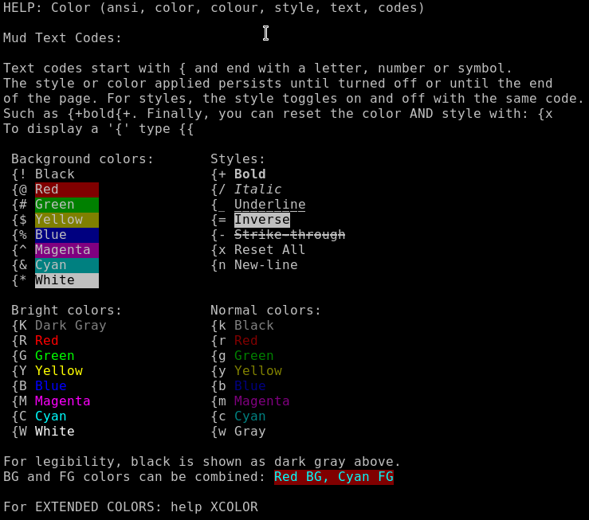
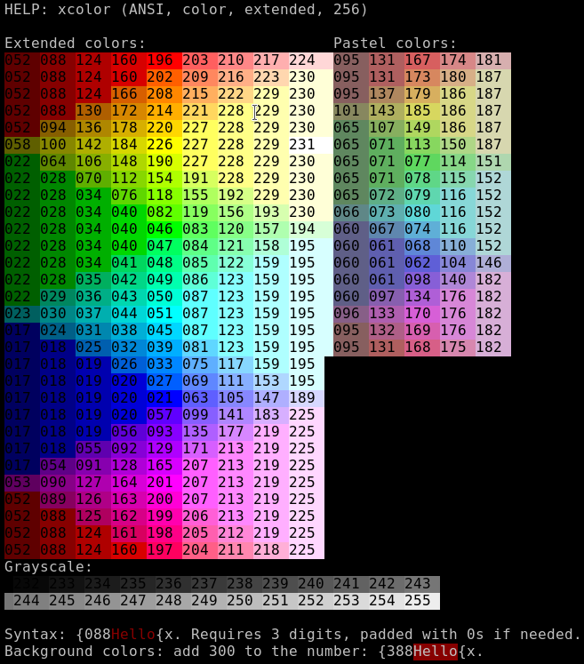
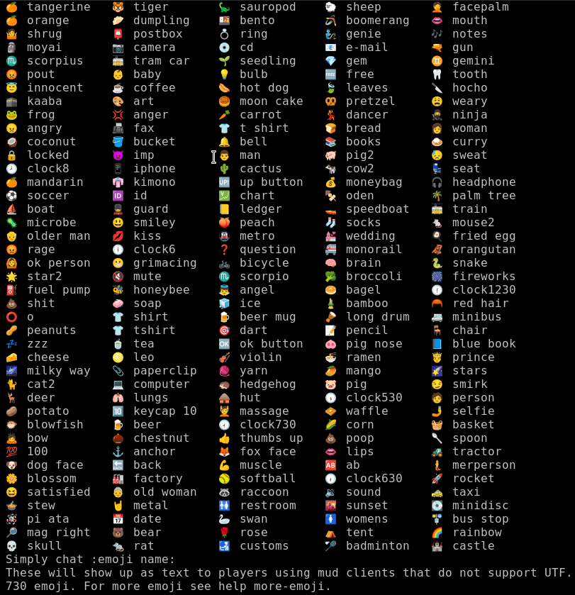

# GoMUD2

GoMUD2 is a modern MUD (Multi-User Dungeon) server written in Go. It aims to be small, fast and easy to hack on while supporting a wide range of clients.

## Features

- **Threaded networking** with flood protection and asynchronous input buffering
- **Telnet option negotiation** including MTTS and NAWS
- **Unicode aware** with character map negotiation and translation
- **ANSI color with 256-colour support**
- **Secure accounts** with hashed passphrases and optional TLS/SSL
- **Chat channels, tells and emotes** with offline message storage
- **Basic world and OLC** to create and edit rooms from within the game
- **Emoji shortcuts, FIGlet fonts** and other fun extras
- Built-in help system, stats command and more

Below are a few handy reference charts from the `dev-notes` directory:





## Getting Started

1. Install **Go 1.22** or newer from [go.dev](https://go.dev/dl/).
2. Build and run the server:

   ```bash
   go build
   ./goMUD2     # or: go run main.go
   ```
3. For encrypted connections generate test certificates:

   ```bash
   ./makeTestCert.sh
   ```

   The server listens on port `7777` (plain) and `7778` (TLS) by default.

Connect with any standard MUD or telnet client and explore!

## Source Layout

The bulk of the Go code lives in the repository root:

- `main.go` starts the server and spawns the networking loops.
- `listener.go`, `telnet.go` and `telnet_opt.go` handle client connections and
  telnet option negotiation.
- `player.go`, `player_struct.go` and `player_save.go` implement characters and
  account persistence.
- `areas.go` and related files provide the basic world and OLC commands.

The `figletlib` directory contains a small FIGlet rendering library used for
banner text. Runtime data such as areas and help files live in the `data`
directory. Development notes—including the images above—are kept in
`dev-notes`.

## Contributing

Pull requests and bug reports are welcome. The project is intentionally minimal so you can add your own ideas easily.

## License

This project is released under the [MIT License](LICENSE).
